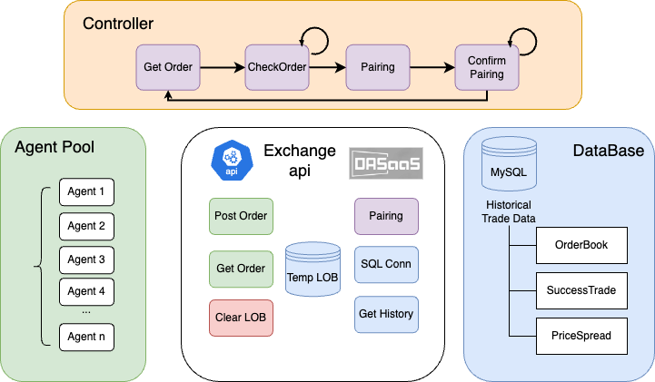

# ABM-Retail-Commodity
Retail Commodity Pricing Strategy by ABM

## Market Rules
### Producer -> Market -> Buyer
1. Producer produce product and sale in Market
2. Buyer goes to the market to buy product
3. Multiple Markets (Limit order books)

### Enviroment Framework

#### Agents:
1. Producer: 
    - S: Strategy
    - Q_max: Max Quantity(Products have limits)
    - output: (
        Market: Int, # Market ID
        Price : float, # Price
        Quantity : Int, # n times base quantity
        Side: Char, #P for producer, B for buyer
        agent_name: Char # Producer ID
        )
2. Buyer:
    - S: Strategy
    - Q_max: Max Quantity(Buyers can't buy as mush as they want)
    - Output: (
        Market: Int, # Market ID
        Price : float, # Price
        Quantity : Int, # n times base quantity
        Side: Char, #P for producer, B for buyer
        Buyer_name: Char # Buyer ID
        )
#### Market:
1. A limit order book design, accepts orders from Producer and Buyer. Does not accept second submission from the same Buyer ID.
2. Match making, return (Price, Quantity)

#### Controller:
1. Call all agents to submit price to Markets.
2. Check all markets if all the agents submitted their price, then start calling markets to match orders. Matching price due to sell price.
3. Get returns from all markets, Store (Price, Quantity) to trade_history. 
4. Calculate Surplus, Store surplus to surplus_history.
5. repeat 1-4 for n times (we set n to 50)

## Experiment:
### ZI strategy:
1. 2 producer, 2 buyer, 2 markets. 
2. 2-20 producer, 2 buyers, 2 markets. 
3. 2 producer, 2-1000 buyers, 2 markets.
4. add buyer max quantity.

### Design different strategies:
to do: Research different strategies
Thoughts:
- ZI
- ZIP
- Commodity Pricing strategy: 
[reference]:https://economictimes.indiatimes.com/definition/pricing-strategies
    - Premium pricing: high price is used as a defining criterion. Such pricing strategies work in segments and industries where a strong competitive advantage exists for the company. Example: Porche in cars and Gillette in blades.
    - Penetration pricing: price is set artificially low to gain market share quickly. This is done when a new product is being launched. It is understood that prices will be raised once the promotion period is over and market share objectives are achieved. Example: Mobile phone rates in India; housing loans etc.
    - Economy pricing: no-frills price. Margins are wafer thin; overheads like marketing and advertising costs are very low. Targets the mass market and high market share. Example: Friendly wash detergents; Nirma; local tea producers.
    - Skimming strategy: high price is charged for a product till such time as competitors allow after which prices can be dropped. The idea is to recover maximum money before the product or segment attracts more competitors who will lower profits for all concerned. Example: the earliest prices for mobile phones, VCRs and other electronic items where a few players ruled attracted lower cost Asian players. 

## API handbook
### Start server
`python3 LOB_api.py` -> this will start a local api server  by uvicorn

### Post orders
curl -X 'POST' 'http://0.0.0.0:8000/orders/' -H 'accept: application/json'  -H 'Content-Type: application/json' 
  -d '{
    "Market": 1,
    "Price" : 100,
    "Quantity" :  10,
    "Side": "B" ,
    "agent_name": "B00001"
}

### LOB
tick | Order1 | Order2 | ... | Order n
---
1    |  (Price, Volumn, side) | 

### Self record
tick | Agent1 | Agent 2 | Agent 3
---
1    | [Price, Amount, total_amount]

## Reference
1. [An Agent-Based Modeling and Simulation Approach to Commodity Markets(paper)](https://journals.sagepub.com/doi/10.1177/0894439318768454?icid=int.sj-abstract.similar-articles.1)
2. [Cocoa statistics](https://www.statista.com/outlook/cmo/hot-drinks/cocoa/worldwide#key-players)
3. 

